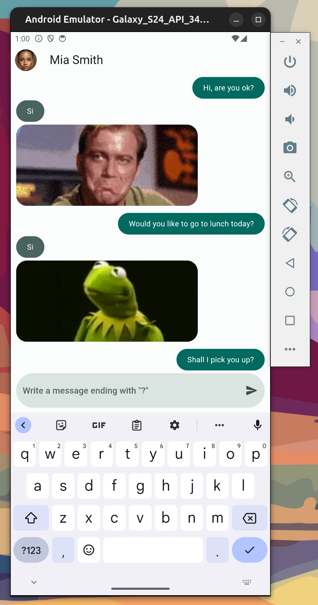

# Yes No App

### Descripción
Yes No App es una aplicación tipo chat en la cual los usuarios pueden enviar mensajes en forma de preguntas que terminen con un signo de interrogación (?). La aplicación responde automáticamente a estas preguntas con una respuesta de "sí" o "no", acompañada de un GIF animado. La funcionalidad de la aplicación se basa en el uso de la API de https://yesno.wtf/api.

### Propósito

Esta aplicación fue creada como un proyecto de aprendizaje para familiarizarse con el desarrollo de aplicaciones móviles utilizando Flutter. Flutter es un kit de desarrollo de software (SDK) de código abierto creado por Google, que se utiliza para desarrollar aplicaciones nativas compiladas para móviles, web y escritorio desde una única base de código.

### Características

    - Envío de mensajes tipo chat.
    - Respuesta automática a preguntas con "sí" o "no".
    - GIF animado que acompaña cada respuesta.
    - Interfaz de usuario sencilla e intuitiva.

# yes_no_app
